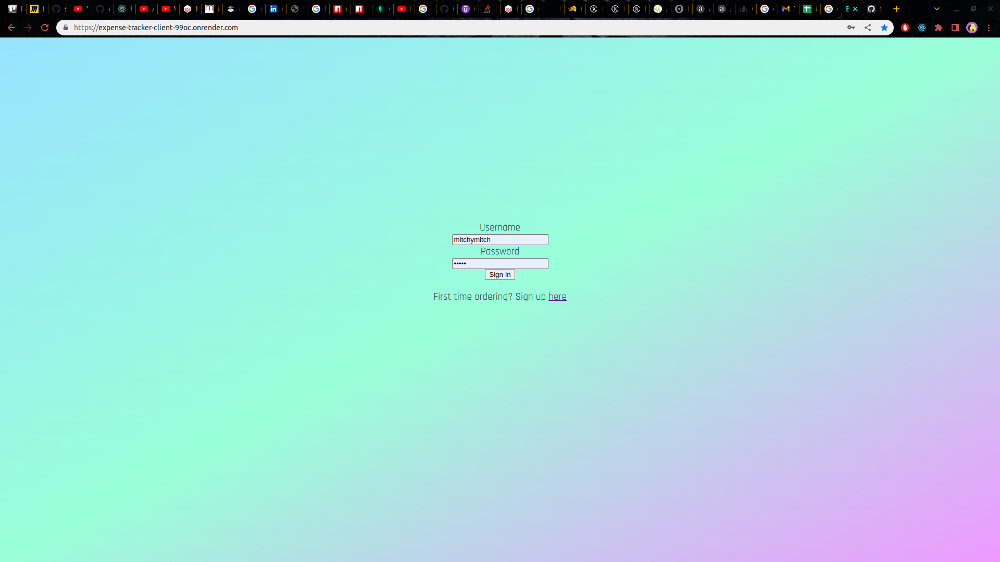
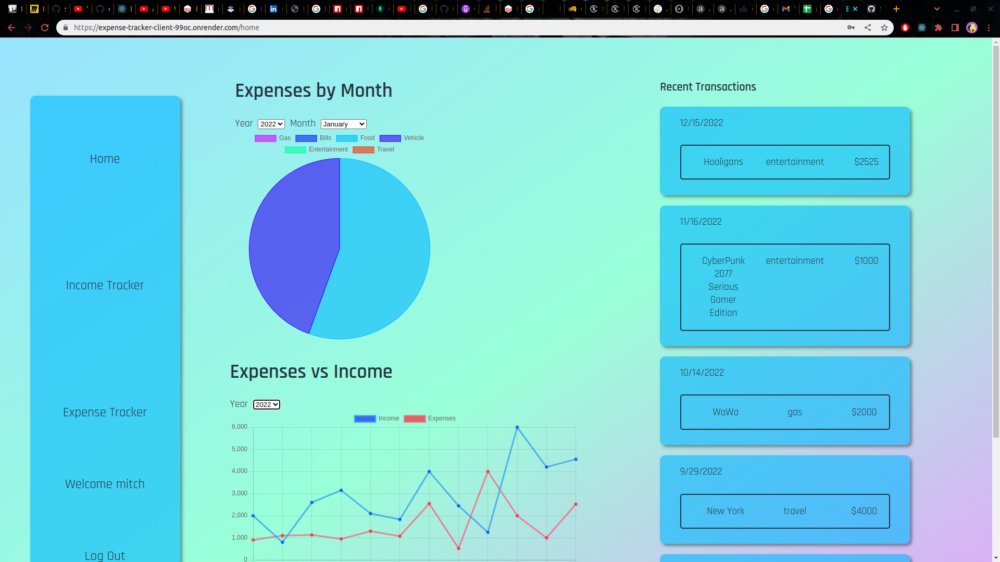
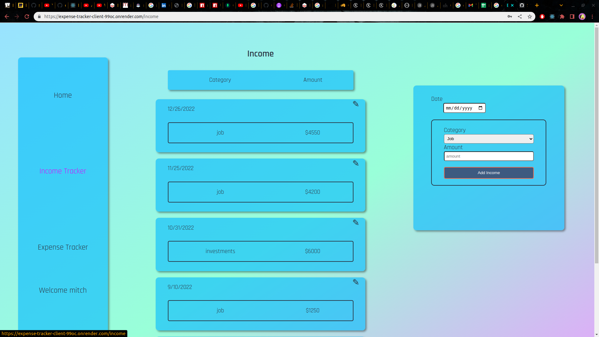
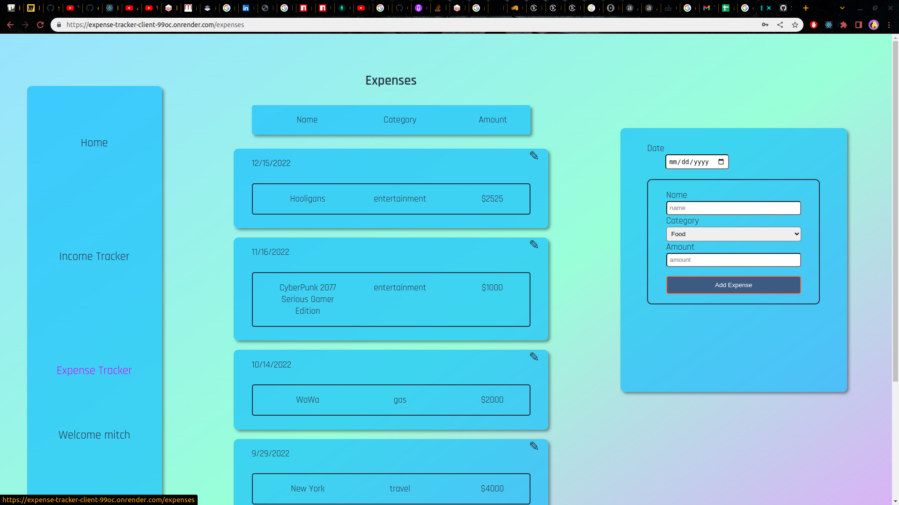
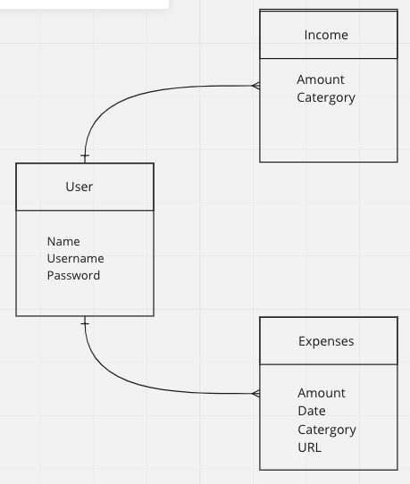

# Expense and Bill Tracker

This app is used to have a convenient place to keep track of all of your bills and expenses. It will allow you to visualize your spending habits based on different categories and see where all of your hard earned money is going. You can also keep track of your income and see how that compares to your expenses for each month.

## Screenshots

## ERD

## Technologies Used

- HTML
- CSS
- React
- Express
- Node
- Mongoose

## Getting Started

[Expense Tracker](https://expense-tracker-client-99oc.onrender.com)

[Trello Board](https://expense-tracker-client-99oc.onrender.com/home)

## MVP

- As a user, I want to able to create an account
- As a user, I want to be able to log in
- As a user, I want to be able to log out
- As a user, I want to be able to see expenses
- As a user, I want to be able to create expenses
- As a user, I want to be able to delete expenses
- As a user, I want to be able to update expenses
- As a user, I want to be able to add bills
- As a user, I want to be able to delete bills
- As a user, I want to be able to update bills
- As a user, I want to be able to see all bills
- As a user, I want to see my dashboard on login
- As a user, I want to see a graph of my expenses

## Next Steps

### Version 2

- As a user, I want to be able to set a budget
- As a user, I want to see if I am above or below my budget

### Version 3

- As a user, I want to be able to download a copy of my monthly expenses